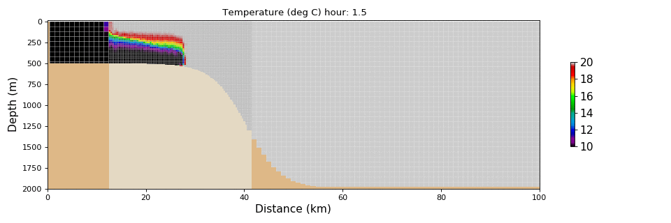
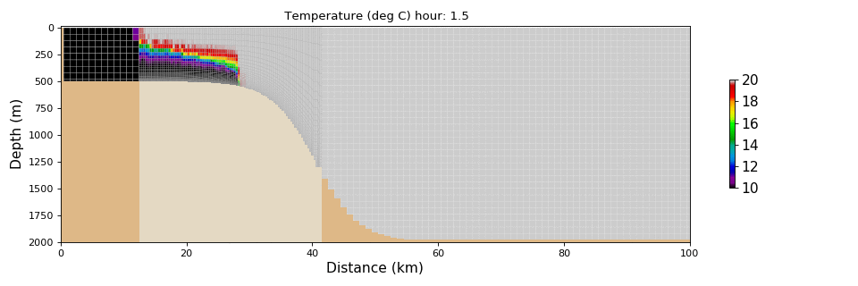

# DEMO

Here are a couple of animations illustrating the nesting of grids with different vertical coordinates (and horizontal resolution). 
"zps" refers to z-coordinates with partial bottom cells.
"sco" means s continuous coordinates, here steched over the bottom 
## OVERFLOW test case:
Outer grid has zps coordinates and 60m (1km) vertical (horizontal) grid spacing. If not stated otherwise, grid coupling is "two-way", so that the embedded (child) grid feedbacks its solution to the outer (parent) grid. In any case, nested grid is horizontally refined by a factor 3.
### zps with a vertical refinement of 3

### sco domain intersecting slope

### sco extended domain

### sco extended domain with 1-way nesting

