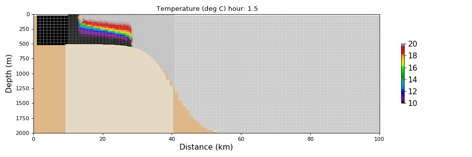

# DEMO

Here are a couple of animations illustrating the nesting of grids with different vertical coordinates (and horizontal resolution). 
+ "zps" refers to z-coordinates with partial bottom cells.
+ "sco" means s continuous coordinates, here streched over the bottom 
## OVERFLOW test case:
Outer grid has zps coordinates and 60m (1km) vertical (horizontal) grid spacing. If not stated otherwise, grid coupling is "two-way", so that the embedded (child) grid feedbacks its solution to the outer (parent) grid. In any case, nested grid is horizontally refined by a factor 3.
### zps with a vertical refinement of 3

### sco domain intersecting slope

The animation above was performed with an horrible bug in the definition of s-coordinates. This was affecting the definition of the thickness of the first layer at w-point (i.e. e3w(1), with Fortran indexing). This was impacting the pressure computation and, quite surprinsingly, was slowing down the plume enough such that the results were pretty good. Correcting this, issues at the interface show up, with a plume leaving the bottom across the interface and flushed out the zoom horizontally.

Smoothing layers horizontally and adding a couple of levels near the bottom does improve the connection as seen in the next video.

### sco extended domain

### sco extended domain with 1-way nesting

