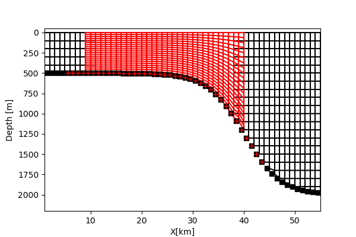

# IMMERSE REPO
## AGRIFTESTCASES:
Scripts to create meshes (domcfg.nc files) for AGRIF in simple test cases. Nested grids can have different vertical coordinate systems (e.g. z with partial cells or s-coordinates).

